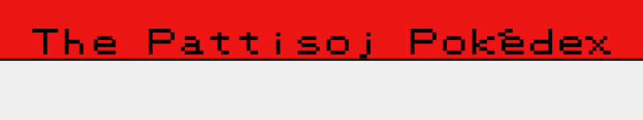
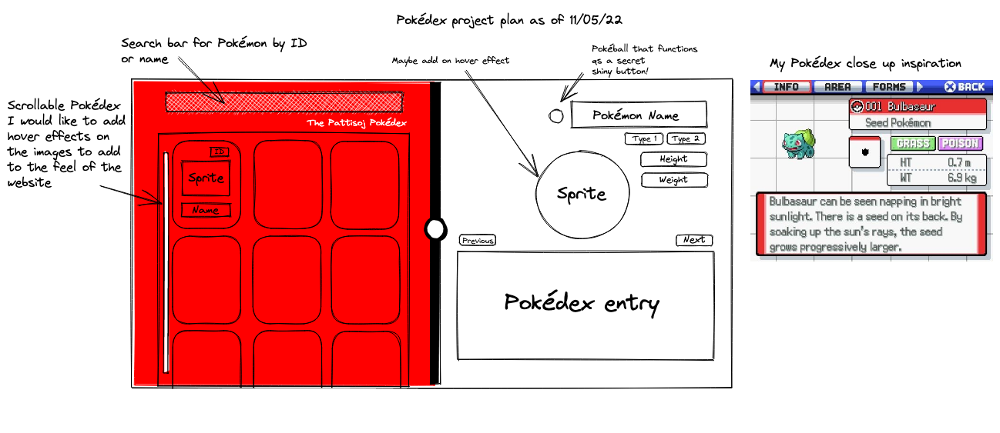

# My Pokédex Project.

 
 
The Pattisoj Pokédex is a personal project to help me develop my HTML, CSS and JavaScript skills. As well as developing further skills.

---

## The Project Plan.

This project has been created to stretch my (current) abilities and allow me to learn more alongside my coding boot camp. I intend to be creative and also delve into the automated testing of my code.

_This was the plan created on 11/05/22_

## Usage.

As this is a personal project intended to develop my skills large pull requests will not be granted. However, small changes that may develop my skills, or issues raised that could improve my code and knowledge are welcomed!

---

## License.

[MIT.](https://choosealicense.com/licenses/mit/)

---

## Credits.

Thanks to [PokeAPI](http://pokeapi.co/) and [Bulbapedia](http://bulbapedia.bulbagarden.net/) for the Pokémon data, and of course to Nintendo, Game Freak, and The Pokémon Company.
